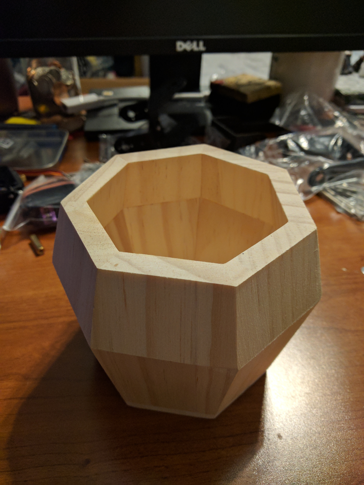

# Quadruped

A Four Legged robot in the making from scratch.
 Currently uses:
 Find video of working leg in images file
<ul>
  <li>3 Servos (MG995's & MG996's)
  <li>Arduino Uno (will try to switch to nano)
  <li>Adafruits 16-channel PWM driver
  <li>5V 12A AC/DC adapter
  <li>Wooden Box
</ul>

Steps: 

